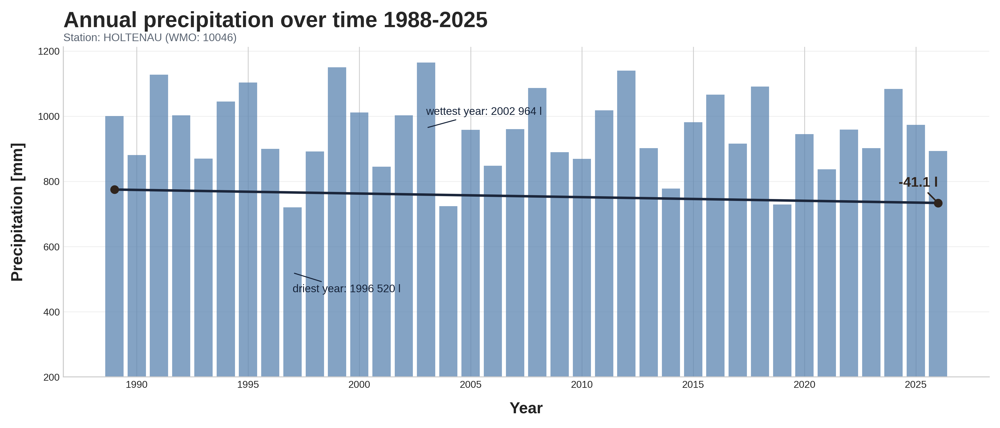
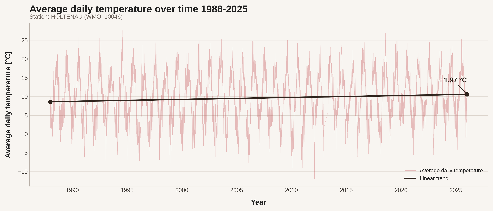

# Local Climate Signal Explorer

Explore long-term **temperature** and **precipitation** at a weather station near your coordinates, using daily data from [Meteostat](https://meteostat.net/). The main entry point is the Jupyter notebook `Local-Climate-Signal-Explorer.ipynb`: it finds the nearest station, computes linear trends, and exports two charts.

Example output for **Kiel / Holtenau** (WMO 10046), 1988–2025:

| Precipitation                                                            | Temperature                                                                   |
| ------------------------------------------------------------------------ | ----------------------------------------------------------------------------- |
|  |  |

_Annual totals with trend (mm). Figures in [`assets/`](assets/)._

_Daily means with linear trend (°C). Warming annotation is the change along the trend line over the full period._

## What the notebook does

1. **Station lookup** — Meteostat returns the closest station to your latitude/longitude.
2. **Precipitation** — Drop missing days, sum to calendar years, fit a linear trend on complete years, bar chart with wettest/driest annotations.
3. **Temperature** — Daily mean `tavg`, linear trend over day index (slope × 365 ≈ °C per year), time-series chart with warming annotation.

Precipitation can be sparse for some stations or periods; missing values are excluded before analysis.

## Requirements

- Python 3
- [meteostat](https://github.com/meteostat/meteostat-python)
- `matplotlib`, `numpy`

Install dependencies (example):

```bash
pip install meteostat matplotlib numpy
```

## How to run

1. Open `Local-Climate-Signal-Explorer.ipynb`.
2. Under **Set coordinates for location/weather station**, add your site to `stat_dict` (name → `_lat` / `_lon` in decimal degrees, WGS84).
3. Set `location` to that key.
4. Adjust `start` and `end` if needed (station metadata is printed after fetch).
5. Run all cells top to bottom.

The notebook writes PNGs next to the working directory as `{location}{wmo}prcp.png` and `{location}{wmo}temp.png`. Copy representative results into `assets/` if you want them in the README.

## Repository contents

| Path                                  | Description                            |
| ------------------------------------- | -------------------------------------- |
| `Local-Climate-Signal-Explorer.ipynb` | Analysis and plotting workflow         |
| `assets/`                             | Example figures (Holtenau / WMO 10046) |

## Compare with other tools

For city-level context, see the [Fitz Lab city app](https://fitzlab.shinyapps.io/cityapp/).

## Data source

Weather data © [Meteostat](https://meteostat.net/). See their documentation for coverage, units, and licensing.
